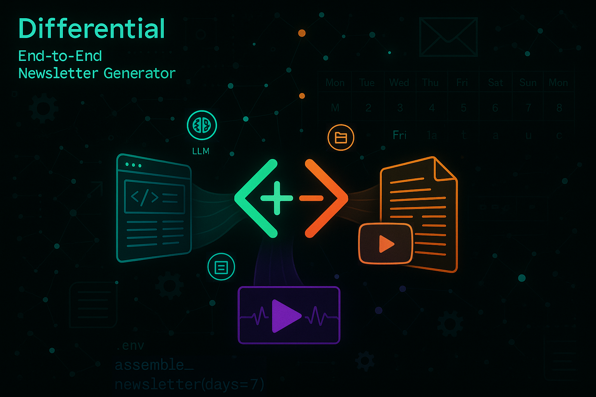

# Differential - Newsletter Generator

End-to-end newsletter generation. Creates newsletters based on the last x days of information extracted from content links.



## Features
- Ingests content from URLs shared in WhatsApp
- Processes web pages, PDFs, and YouTube videos
- Uses LLMs to categorise and summarise content
- Assembles a weekly newsletter in Markdown format

## Setup
1. Clone the repository
2. Install dependencies: `uv sync`

## Configuration
Create a `.env` file with the following variables:
```
OPENAI_API_KEY=your_openai_api_key
GEMINI_API_KEY=your_gemini_api_key  # Only needed if using Gemini
MODEL_PROVIDER=openai  # Options: openai, gemini
WHATSAPP_VERIFY_TOKEN=your_secure_random_token
```

### Model Provider Configuration

Differential supports two LLM providers:

1. **Gemini** (default): Uses Google's Gemini models for content processing
2. **OpenAI**: Uses OpenAI's models for content processing

You can configure the provider in several ways:

1. **Environment Variable**: Set `MODEL_PROVIDER=gemini` in your `.env` file
2. **Command Line**: Specify the provider when generating a newsletter:
   ```
   # Generate newsletter using Gemini
   uv run -m newsletter_generator.newsletter --model-provider gemini
   
   # Generate newsletter using OpenAI (default)
   uv run -m newsletter_generator.newsletter --model-provider openai
   ```
3. **Programmatically**: When calling the API directly, you can specify the provider:
   ```python
   from newsletter_generator.ai.processor import ModelProvider
   from newsletter_generator.newsletter.assembler import assemble_newsletter
   
   # Use Gemini
   result = assemble_newsletter(days=7, model_provider=ModelProvider.GEMINI)
   ```

### Generating a WhatsApp Verify Token
The WHATSAPP_VERIFY_TOKEN is a secure string used to verify webhook requests from Meta:

1. Create a secure random string. For example, using Python:
   ```
   python -c "import secrets; print(secrets.token_hex(16))"
   ```
2. Add this token to your `.env` file as WHATSAPP_VERIFY_TOKEN
3. Use the same token in the Meta Developer Portal webhook configuration

## Local Development with ngrok
To test WhatsApp webhooks during local development:

1. Install ngrok:
   ```
   uv add ngrok
   ```
   Or download from https://ngrok.com/download

2. Start the webhook server:
   ```
   uv run src/newsletter_generator/whatsapp/webhook_receiver.py
   ```

3. In a separate terminal, create a tunnel to your local server:
   ```
   ngrok http 8000
   ```

4. Copy the HTTPS URL from ngrok output (e.g., https://a1b2c3d4.ngrok.io)

5. Configure your webhook in the Meta Developer Portal:
   - Callback URL: `https://a1b2c3d4.ngrok.io/webhook`
   - Verify Token: The same token from your `.env` file
   - Subscribe to: `messages`

6. Meta will send a verification request to confirm your endpoint is working

Note: The ngrok URL changes each time you restart ngrok unless you have a paid plan.

## Usage

1. Start the WhatsApp webhook server:
   ```
   uv run src/newsletter_generator/whatsapp/webhook_receiver.py
   ```

2. Tunnel local server using ngrok (in a separate terminal):
   ```
   ngrok http 8000
   ```

3. Share URLs in your WhatsApp group. The system will:
   - Receive URLs via WhatsApp webhook
   - Automatically extract and validate URLs from messages
   - Determine content type (HTML, PDF, YouTube)
   - Fetch and process content based on its type
   - Store processed content with metadata in the filesystem

4. Generate a weekly newsletter:
   ```
   # Generate using last 7 days of content (default)
   uv run -m newsletter_generator.newsletter

   # Or specify custom number of days
   uv run -m newsletter_generator.newsletter --days 5
   
   # Generate using Gemini instead of OpenAI
   uv run -m newsletter_generator.newsletter --model-provider gemini
   
   # Combine options
   uv run -m newsletter_generator.newsletter --days 10 --model-provider gemini
   ```

5. Find generated newsletters in the `data/newsletters` directory.

## How It Works

### Ingestion Pipeline

1. **URL Reception**: URLs are received through the WhatsApp webhook with robust error handling.
2. **Content Type Detection**: System automatically detects if the URL is a webpage, PDF, or YouTube video.
3. **Content Processing**: Content is processed using a polymorphic architecture:
   - **Fetching**: Content is fetched from the source using the appropriate processor
   - **Parsing**: Raw content is parsed into a structured format
   - **Standardisation**: All content is standardised to a uniform format
4. **Storage**: Processed content is stored with relevant metadata for later use.

For more details on the ingestion architecture, see the [Ingestion Documentation](src/newsletter_generator/ingestion/README.md).
For more details on the WhatsApp integration, see the [WhatsApp Documentation](src/newsletter_generator/whatsapp/README.md).

### Newsletter Generation

1. **Content Collection**: The system collects all content ingested in the last week.
2. **LLM Processing**: Content is categorised and summarised using LLM.
3. **Content Organisation**: Content is organised by category.
4. **Newsletter Assembly**: A markdown document is assembled with all processed content.

## Customising the Newsletter

You can customise the newsletter generation by modifying the following:

- Content categorisation: Update LLM prompts in the `ai/processor.py` file
- Newsletter template: Modify the `assemble_newsletter` method in `newsletter/assembler.py`
- Content sources: Currently supports web pages, PDFs, and YouTube videos

## Troubleshooting

- Check the log file `newsletter_generator.log` for detailed information
- Ensure your WhatsApp webhook is properly configured in the Meta Developer Portal
- Verify that your `.env` file contains the required API keys and tokens
- If URLs are not being processed, check the connection between the webhook and the ingestion pipeline

## Testing the Ingestion Pipeline

You can test the ingestion pipeline directly without setting up the WhatsApp webhook:

```
# Test with a single URL
uv run src/newsletter_generator/ingestion/test_ingest.py https://example.com

# Test with multiple URLs
uv run src/newsletter_generator/ingestion/test_ingest.py https://example.com https://youtube.com/watch?v=12345 https://example.org/document.pdf
```

This allows you to:
- Verify the ingestion pipeline is working correctly
- Test different content types (HTML, PDF, YouTube)
- Debug issues with content fetching and processing

## Content Storage and Deduplication

Differential implements a content-addressed storage system with comprehensive deduplication to efficiently manage content and prevent duplicates:

### Content-Addressed Storage
- Content is stored using a content ID as the primary identifier
- Files are organised in a predictable path structure: `{data_dir}/{content_id[:2]}/{content_id}/{source_type}.md`
- The file system serves as the single source of truth
- For more details, see the [Storage Documentation](data/STORAGE.md)

### URL-Based Deduplication
- URLs are normalised to remove tracking parameters (utm_source, fbclid, etc.)
- Identical URLs with different tracking parameters are recognised as duplicates
- Shares of the same URL on different days are automatically detected

### Content-Based Deduplication
- Each piece of content is fingerprinted based on significant words
- Similar content from different URLs can be detected as duplicates
- Prevents different articles discussing the same topic with very similar text

### Unified Caching System
- Common caching interface used by both storage and AI processing
- Atomic file operations prevent corruption during updates
- Transaction-like operations ensure consistency
- Enhanced error handling with automatic recovery

### How It Works
1. When content is ingested, it's assigned both a URL hash and a content fingerprint
2. Content is stored in a content-addressed structure for efficient retrieval
3. During ingestion, the system checks if similar content already exists
4. During newsletter assembly, additional fingerprint checks prevent duplicates from different categories

This allows the system to:
- Prevent duplicate URLs from being processed multiple times
- Save processing time and API costs
- Ensure newsletters contain truly unique content
- Handle the case of the same URL being shared multiple times
- Provide reliable and efficient content storage

No configuration is needed - the storage system and deduplication are automatically enabled for all new content.
