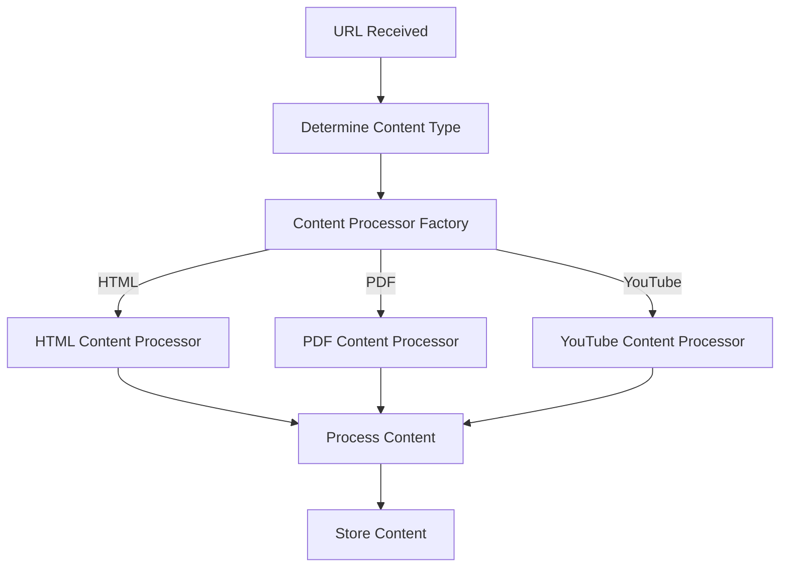

# Newsletter Generator - Content Ingestion System

This module handles the ingestion of content from various sources (HTML, PDF, YouTube) for the newsletter generator. It uses a polymorphic architecture with a common interface for all content types.

## Architecture Overview

The ingestion system follows a clean, extensible architecture:

1. **ContentProcessorInterface**: Abstract base class defining the interface for all content processors
2. **Concrete Processors**: Implementations for specific content types (HTML, PDF, YouTube)
3. **Factory Pattern**: Creates appropriate processors based on content type
4. **Orchestrator**: Coordinates the ingestion process using the processors

## Content Processing Pipeline

Each content processor implements a standardised pipeline:

1. **Fetch**: Retrieves raw content from a URL
2. **Parse**: Converts raw content into a structured format
3. **Standardise**: Transforms parsed content into a uniform format
4. **Process**: Orchestrates the fetch, parse, and standardise steps


## ContentProcessorInterface

The `ContentProcessorInterface` defines the contract that all content processors must implement:

```python
class ContentProcessorInterface(ABC):
    @abstractmethod
    async def fetch(self, url: str) -> str:
        """Fetch content from a URL."""
        pass
    
    @abstractmethod
    def parse(self, raw_content: str, url: str = None) -> Dict[str, Any]:
        """Parse raw content into a structured format."""
        pass
    
    @abstractmethod
    def standardise(self, parsed_content: Dict[str, Any]) -> str:
        """Standardise parsed content into a uniform format."""
        pass
    
    async def process(self, url: str) -> Tuple[str, Dict[str, Any]]:
        """Process a URL through the entire pipeline."""
        raw_content = await self.fetch(url)
        parsed_content = self.parse(raw_content, url)
        standardised_content = self.standardise(parsed_content)
        
        metadata = {
            "url": url,
            "source_type": self.get_source_type(),
            "status": "pending_ai",
        }
        
        return standardised_content, metadata
```

## Concrete Processors

### HTMLContentProcessor

Processes HTML content from web pages:
- **Fetch**: Uses aiohttp to retrieve HTML content
- **Parse**: Extracts title, text, and metadata using BeautifulSoup
- **Standardise**: Formats content into a consistent Markdown structure

### PDFContentProcessor

Processes PDF documents:
- **Fetch**: Downloads PDF files
- **Parse**: Extracts text and metadata using PyMuPDF and pymupdf4llm
- **Standardise**: Formats content into a consistent Markdown structure

### YouTubeContentProcessor

Processes YouTube videos:
- **Fetch**: Retrieves video metadata and transcript
- **Parse**: Extracts title, description, and transcript
- **Standardise**: Formats content into a consistent Markdown structure

## Factory Pattern

The `ContentProcessorFactory` creates the appropriate processor based on content type:

```python
class ContentProcessorFactory:
    @staticmethod
    def get_processor(content_type: str) -> ContentProcessorInterface:
        """Get the appropriate processor for a content type."""
        if content_type == "html":
            return HTMLContentProcessor()
        elif content_type == "pdf":
            return PDFContentProcessor()
        elif content_type == "youtube":
            return YouTubeContentProcessor()
        else:
            raise ValueError(f"Unsupported content type: {content_type}")
```

## Ingestion Orchestrator

The `IngestionOrchestrator` coordinates the ingestion process:

1. Determines the content type of a URL
2. Gets the appropriate processor from the factory
3. Processes the URL using the processor
4. Returns the standardised content and metadata



## Error Handling

The system implements comprehensive error handling:

- **Type-specific errors**: Each processor handles errors specific to its content type
- **Common error handling**: Shared error handling logic in the interface
- **Graceful degradation**: Falls back to simpler processing when advanced features fail

## Usage Examples

### Processing a URL

```python
from newsletter_generator.ingestion.orchestrator import ingest_url

# Process a URL
content, metadata = await ingest_url("https://example.com/article")
```

### Using the Orchestrator Directly

```python
from newsletter_generator.ingestion.orchestrator import IngestionOrchestrator

# Create an orchestrator
orchestrator = IngestionOrchestrator()

# Determine content type
content_type = await orchestrator.determine_content_type("https://example.com/article")

# Process URL
content, metadata = await orchestrator.process_url("https://example.com/article")
```

## Adding New Content Types

To add support for a new content type:

1. Create a new class that implements `ContentProcessorInterface`
2. Implement the `fetch`, `parse`, and `standardise` methods
3. Update the `ContentProcessorFactory` to return your new processor
4. Update the `determine_content_type` method in `IngestionOrchestrator` if needed

Example for a new "API" content type:

```python
class APIContentProcessor(ContentProcessorInterface):
    async def fetch(self, url: str) -> str:
        # Fetch content from an API
        ...
    
    def parse(self, raw_content: str, url: str = None) -> Dict[str, Any]:
        # Parse API response
        ...
    
    def standardise(self, parsed_content: Dict[str, Any]) -> str:
        # Standardise API content
        ...
    
    def get_source_type(self) -> str:
        return "api"
```

Then update the factory:

```python
@staticmethod
def get_processor(content_type: str) -> ContentProcessorInterface:
    if content_type == "api":
        return APIContentProcessor()
    # Existing processors...
```
