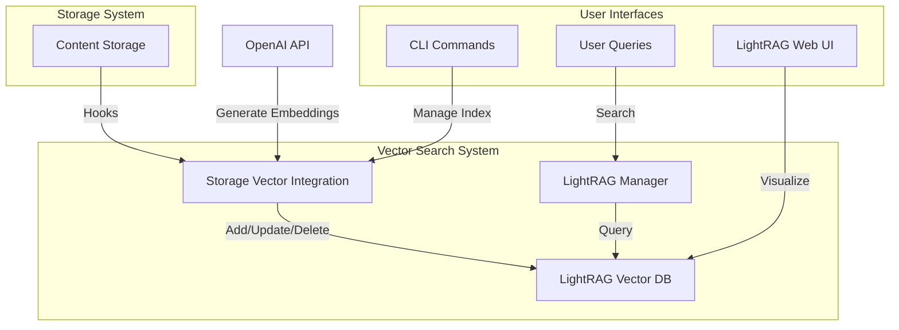
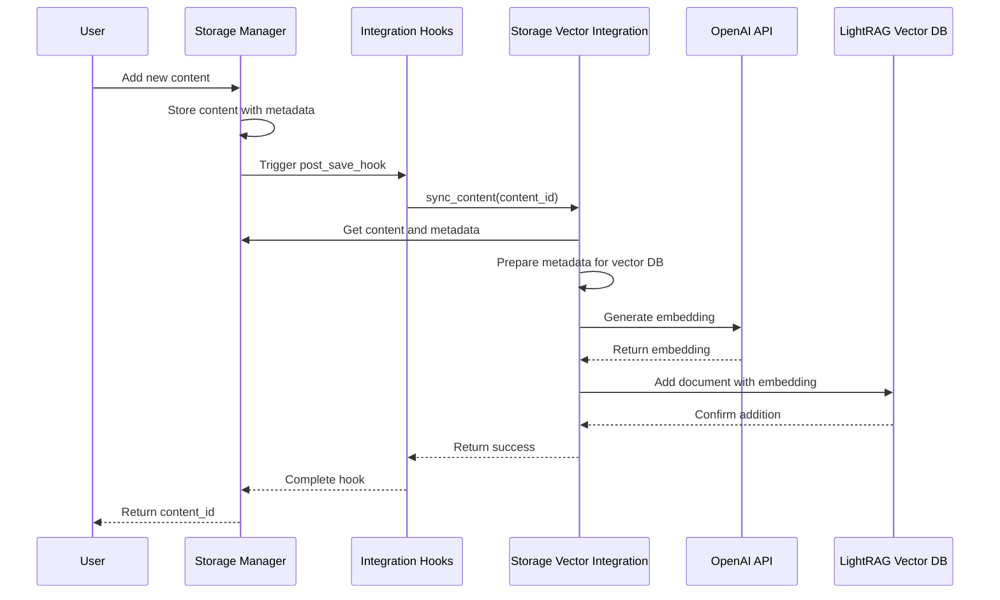
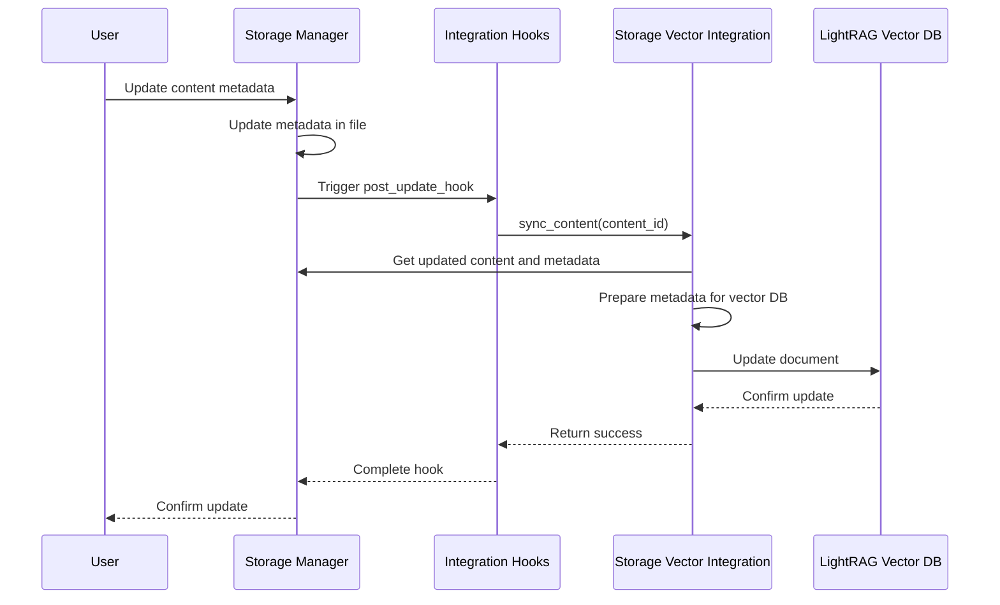
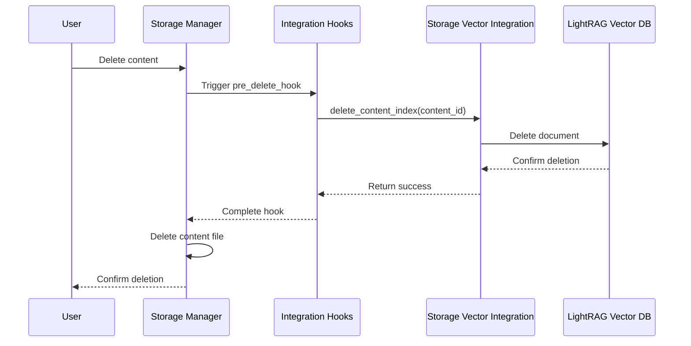

# Vector Search Documentation

This document explains how Differential uses vector search to enable semantic content discovery.

## Architecture

The vector search functionality is built on LightRAG, which provides efficient storage and retrieval of content embeddings. The integration between Differential's content-addressed storage and the vector database is handled by the Storage Vector Integration Layer.



## Integration Flow

When content is processed in Differential, it's automatically indexed in the vector database:



## Content Update Flow

When content is updated, the vector database is automatically updated as well:



## Content Deletion Flow

When content is deleted, it's also removed from the vector database:



## Search Flow

Users can search for content semantically:

```mermaid
flowchart LR
    A[User Query] -->|search()| B[LightRAG Manager]
    B -->|Generate Embedding| C[OpenAI API]
    C -->|Return Embedding| B
    B -->|Query with Embedding| D[LightRAG Vector DB]
    D -->|Return Similar Documents| B
    B -->|Format Results| E[Search Results]
    E -->|Display to User| F[User Interface]
```

## Using the Vector Database

### Searching for Content

```python
from newsletter_generator.vector_db.lightrag_manager import search

# Basic search
results = search("artificial intelligence trends", limit=5)

# Search with metadata filters
results = search(
    "machine learning", 
    limit=3, 
    filter_metadata={"category": "Technology"}
)

# Process search results
for result in results:
    print(f"Document ID: {result['id']}")
    print(f"Similarity Score: {result['score']}")
    print(f"Title: {result['metadata'].get('title', 'No title')}")
    print(f"URL: {result['metadata'].get('url', 'No URL')}")
    print("---")
```

### Managing the Index via CLI

```bash
# Index all content in the storage system
uv run -m newsletter_generator.cli.vector_index index-all

# Index specific content by ID
uv run -m newsletter_generator.cli.vector_index index <content_id>

# Update specific content in the index
uv run -m newsletter_generator.cli.vector_index update <content_id>

# Delete specific content from the index
uv run -m newsletter_generator.cli.vector_index delete <content_id>
```

### Using the LightRAG Web UI

LightRAG provides a built-in web interface for exploring your content:

```bash
# Start the LightRAG web server
lightrag serve --storage-path data/vectors
```

Then open your browser to http://localhost:8000 to explore your content.

## Technical Details

### Embedding Model

By default, Differential uses OpenAI's `text-embedding-3-small` model for generating embeddings. This model produces 1536-dimensional embeddings that capture the semantic meaning of text.

### Vector Database Configuration

The LightRAG vector database is configured with the following parameters:

- **Dimension**: 1536 (matching the embedding model)
- **Metric**: Cosine similarity
- **Storage Path**: `data/vectors` (configurable)

### Metadata Transformation

When content is indexed, the following metadata fields are included:

- `title`: The title of the content
- `url`: The source URL
- `source_type`: The type of content (html, pdf, youtube)
- `date_added`: When the content was added
- `content_id`: The unique identifier for the content
- `url_hash`: The hash of the URL for deduplication
- `category`: The category of the content (from AI processing)
- `summary`: A summary of the content (from AI processing)
- `tags`: Tags associated with the content (from AI processing)
