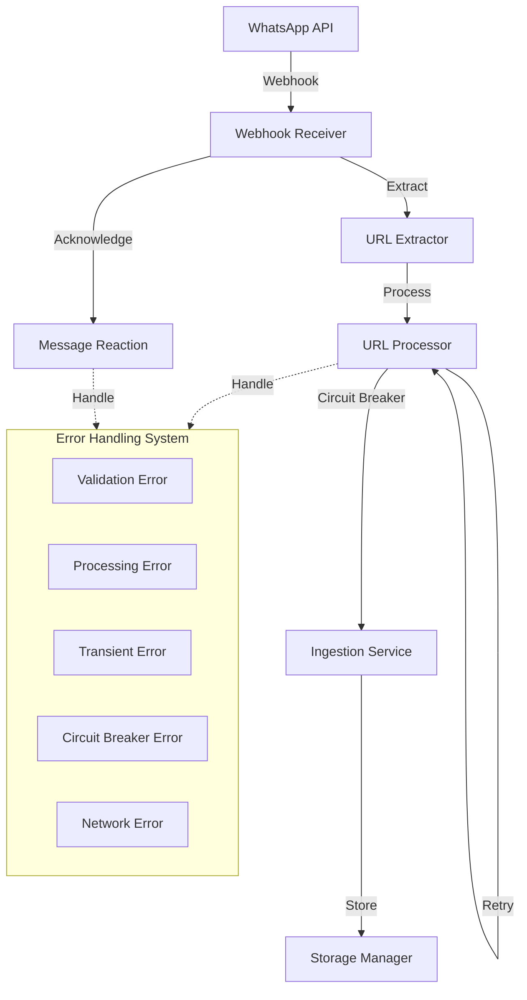
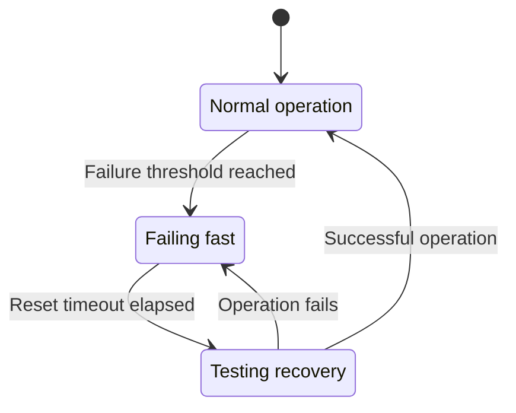

# Newsletter Generator - WhatsApp Integration

This module handles the integration with WhatsApp Business API for receiving URLs and processing them for the newsletter generator. It implements robust error handling, retry mechanisms, and circuit breaker patterns for improved reliability.

## Architecture Overview

The WhatsApp integration consists of:

1. **Webhook Receiver**: FastAPI endpoint for receiving webhook notifications
2. **URL Extraction**: Extracts URLs from incoming messages
3. **URL Processing**: Processes URLs through the ingestion pipeline
4. **Message Acknowledgment**: Sends reactions to received messages
5. **Error Handling**: Structured error types and recovery mechanisms
6. **Circuit Breaker**: Prevents cascading failures during outages



## Webhook Receiver

The webhook receiver is a FastAPI application that:

1. Validates incoming webhook requests from Meta
2. Extracts URLs from message content
3. Sends acknowledgment reactions to received messages
4. Processes URLs asynchronously using background tasks
5. Provides detailed logging and monitoring

## Message Acknowledgment

The system acknowledges received messages by sending a reaction emoji:

1. Each received message gets a checkmark (✅) reaction
2. Reactions are sent asynchronously with retry mechanism
3. Failures to send reactions are logged but don't block URL processing
4. This provides immediate feedback to users that their message was received

```python
@retry(
    stop=stop_after_attempt(3),
    wait=wait_exponential(multiplier=1, min=2, max=10),
    retry=retry_if_exception_type(NetworkError),
)
async def send_message_reaction(message_id: str, sender_phone: str, emoji: str = "✅"):
    # Implementation that sends a reaction to the received message
    # ...
```

## Error Handling System

### Error Hierarchy

The system implements a structured error hierarchy:

```
WebhookError (base class)
├── ValidationError
├── ProcessingError
├── CircuitBreakerError
└── TransientError
    ├── NetworkError
    ├── ServiceUnavailableError
    └── RateLimitError
```

### Error Types

- **WebhookError**: Base class for all webhook-related errors
- **ValidationError**: Invalid webhook payload or format
- **ProcessingError**: Error processing a valid webhook
- **TransientError**: Temporary error that may resolve with retries
  - **NetworkError**: Network connectivity issues
  - **ServiceUnavailableError**: External service unavailable
  - **RateLimitError**: Rate limit exceeded
- **CircuitBreakerError**: Circuit breaker is open

## Retry Mechanism

The system implements an exponential backoff retry mechanism for transient errors:

```python
@retry(
    retry=retry_if_exception_type(TransientError),
    stop=stop_after_attempt(3),
    wait=wait_exponential(multiplier=1, min=2, max=10),
    reraise=True,
    before_sleep=before_sleep_log(logger, logging.INFO),
)
async def process_url(url: str, message_metadata: Dict[str, Any]) -> Dict[str, Any]:
    # Process URL with retry for transient errors
    ...
```

This provides:
- Automatic retries for transient errors
- Exponential backoff to prevent overwhelming services
- Detailed logging of retry attempts
- Maximum retry limit to prevent infinite loops

## Circuit Breaker Pattern

The circuit breaker pattern prevents cascading failures during outages:



States:
- **Closed**: Normal operation, all requests processed
- **Open**: Circuit is broken, requests fail fast
- **Half-Open**: Testing if the system has recovered

The circuit breaker:
1. Tracks failure counts
2. Opens after reaching a threshold
3. Automatically transitions to half-open after a timeout
4. Closes after successful operations in half-open state

## URL Extraction

The system uses regex pattern matching to extract URLs from messages:

1. Matches common URL formats (http://, https://, www.)
2. Validates URLs for proper structure
3. Handles URLs with trailing punctuation
4. Adds https:// to URLs starting with www.

## API Endpoints

The webhook system exposes two main endpoints:

1. **GET /webhook**: Handles the initial verification handshake from Meta
   - Validates the verify token
   - Returns the challenge string for successful verification

2. **POST /webhook**: Processes incoming webhook notifications
   - Extracts messages from webhook payload
   - Acknowledges messages with reactions
   - Processes URLs in the background
   - Returns success response immediately for asynchronous processing

## Transaction-like Operations

The webhook processing implements transaction-like semantics:

1. **Begin**: Start processing a webhook
2. **Process**: Extract and process URLs
3. **Commit/Rollback**: Complete processing or handle errors
4. **Logging**: Record all operations for auditing

## Monitoring and Observability

The system provides detailed monitoring:

- **Structured Logging**: JSON-formatted logs with context
- **Metrics**: Counts of processed URLs, errors, retries
- **Tracing**: Request IDs for tracking webhook processing
- **Health Checks**: Endpoint for monitoring system health

## Usage Examples

### Starting the Webhook Server

```bash
# Start the webhook server
uv run src/newsletter_generator/whatsapp/webhook_receiver.py
```

### Processing a URL Manually

```python
from newsletter_generator.whatsapp.webhook_receiver import process_url

# Process a URL with metadata
result = await process_url(
    "https://example.com",
    {
        "date_added": "2023-01-01T00:00:00Z",
        "source": "whatsapp",
        "sender": "1234567890",
        "message_id": "wamid.123456789",
    }
)
```

### Using the Circuit Breaker

```python
from newsletter_generator.whatsapp.webhook_receiver import circuit_breaker_decorator

@circuit_breaker_decorator
async def my_function():
    # Function protected by circuit breaker
    ...
```

## Configuration

The webhook receiver can be configured through environment variables:

- `WHATSAPP_VERIFY_TOKEN`: Token for webhook verification
- `WHATSAPP_PHONE_NUMBER_ID`: ID of the WhatsApp phone number for your business account
- `WHATSAPP_API_TOKEN`: Authentication token for the WhatsApp Business API
- `WHATSAPP_API_VERSION`: API version to use (default: "v18.0")
- `WEBHOOK_PORT`: Port for the webhook server (default: 8000)
- `WEBHOOK_PATH`: Path for webhook endpoint (default: "/webhook")
- `CIRCUIT_BREAKER_THRESHOLD`: Failure threshold (default: 5)
- `CIRCUIT_BREAKER_TIMEOUT`: Reset timeout in seconds (default: 60)
